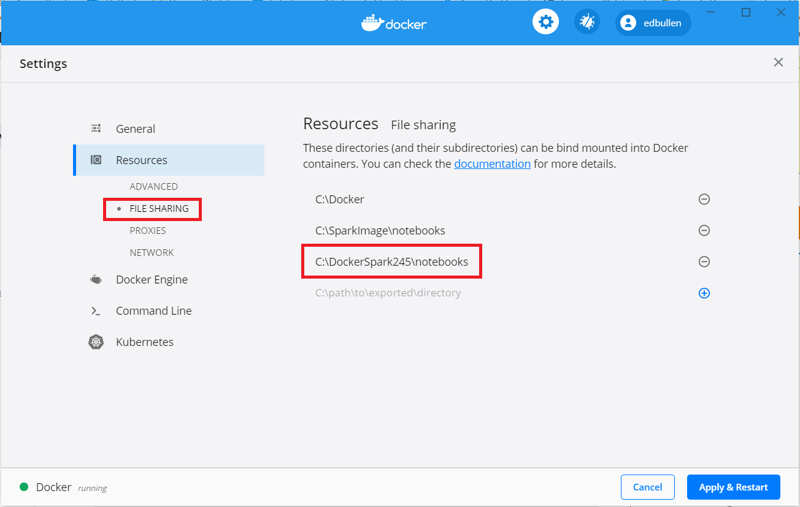

# Spark and Kafka in Docker Cluster #

This build is based on the following article:  https://towardsdatascience.com/apache-spark-cluster-on-docker-ft-a-juyterlab-interface-418383c95445 
 written by [@dekoperez](https://twitter.com/dekoperez) and then adjusted and extended to include Spark Streaming and PySpark compatibility.  
  
A two-node cluster and a spark master are built as Docker images along with a separate JupyterLab environment.  Each runs in a separate container and shares a network and shared file-system.  
  
     
  
## Spark and Hadoop Configuration and Release Information ##

Build as of 2021-01-01  
   
Spark Version `2.4.5` is used to ensure compatibility with PySpark and Kafka and enable spark-streaming that is compatible with PySpark. The Hadoop version is `2.7`
  
These are set at the start of the `build.sh` script and passed in as environment variables to each of the Docker build stages.  
  
Apache Spark is running in *Standalone Mode* and controls its own master and worker nodes instead of Yarn managing them.     
    
Apache Spark with Apache Hadoop support is used to allow the cluster to simulate HDFS distributed filesystem using the shared volume `shared-workspace` that is created during the docker-compose initialisation - as per this  `docker-compose.yml` excerpt:
```
volumes:
  shared-workspace:
    name: "hadoop-distributed-file-system"
    driver: local
```

### Build ###

The Docker images are built by the `build.sh` script.

The following Docker images are created:  
+ `cluster-base` - this provides the shared directory (`/opt/workspace`) for the HDFS simulation.  
+ `spark-base`  - base Apache Spark image to build the Spark Master and Spark Workers on.   
+ `spark-master` - Spark Master that allows Worker nodes to connect via SPARK_MASTER_PORT, also exposes the Spark Master UI web-page (port 8080).  
+ `spark-worker` - multiple Spark Worker containers can be started from this image to form the cluster.    
+ `jupyterlab` -  built on top of the cluster-base with Python and JupyterLab environment set up and sharing the same shared workspace file-system mount as the rest of the cluster.  
  
To allow the JupyterLab container to access the external ./notebooks file-share, enable access to this location in the Docker desktop configuration tool:  

    

### Cluster Dependancies ###

*Docker Compose* is used to link all the cluster components together so that an overall running cluster service can be started.  
  
`docker-compose.yml` initialises a shared cluster volume for the shared filesystem (HDFS simulation) and also maps ./notebooks to a mount point in the JupyterLab Docker container.  

Various other port-mappings and configuration details are set in this configuration file.  Because all the worker nodes need to be referenced at `localhost`, they are mapped to different port numbers (ports 8081 and 8082 for worker 1 and 2).
        
    
### Start ###

```
docker-compose up --detach
```


### Stop ###
```
docker-compose down
```


### Connect to Cluster via JupyterLab ###

Use a web-browser to connect to `http://localhost:8888`  
  
This is enabled by the Docker VM instance which exposes port 8888 to local-host, with a configuration based on top of the Docker image "cluster-base"  

The Jupyter notebooks are stored in the shared workspace `/opt/workspace245/notebooks` which is mounted on a Docker Volume and mapped to a local directory on the docker host.  The volume configuration and mapping to a local file-system mount is specified in the `docker-compose.yml` file and executed at run-time:
```
services:
  jupyterlab:
    image: jupyterlab
    container_name: jupyterlab
    ports:
      - 8888:8888
    volumes:
      - shared-workspace:/opt/workspace
      - ./notebooks:/opt/workspace/notebooks
```

### Connect to Cluster via Shell session on Master ###


## Kafka Build and Operations ##