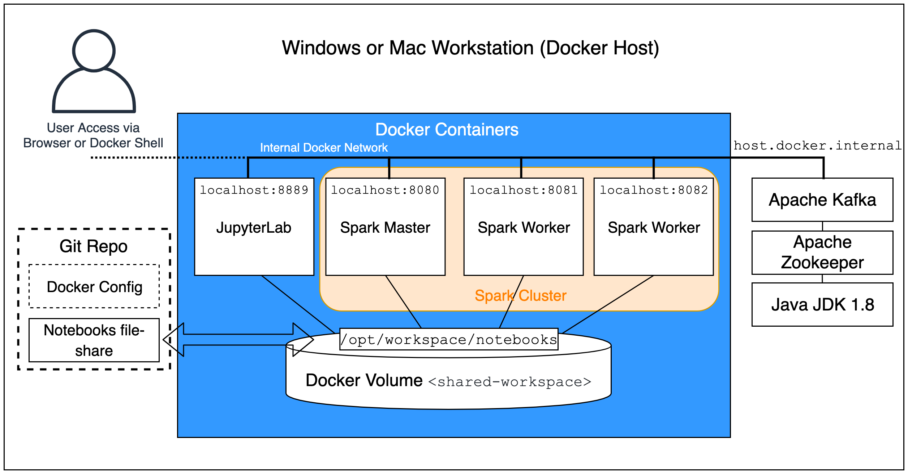
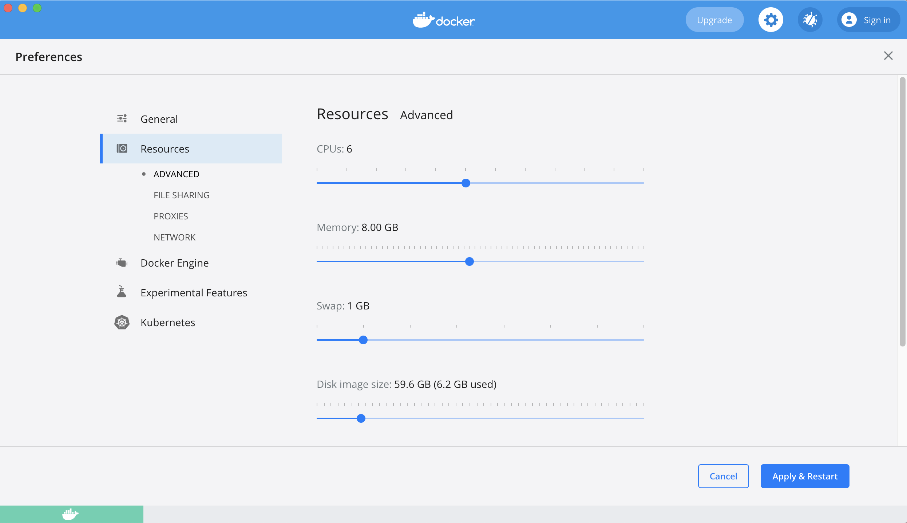
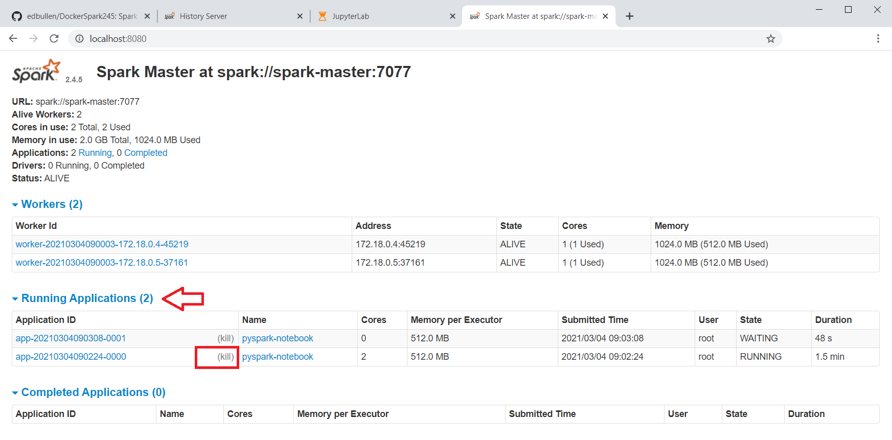

# Spark and Kafka in Docker Cluster #

This build is based on the following article:  https://towardsdatascience.com/apache-spark-cluster-on-docker-ft-a-juyterlab-interface-418383c95445
 written by [@dekoperez](https://twitter.com/dekoperez) and then adjusted and extended to include Spark Streaming and PySpark compatibility.  The build has also been updated to include a working Spark history service.  The Python packages `numpy`, `pandas` and `matplotlib` have been added to the JupyterLab docker file - this increases the size of the image.

A two-node cluster and a spark master are built as Docker images along with a separate JupyterLab environment.  Each runs in a separate container and shares a network and shared file-system.  

     

## Spark and Hadoop Configuration and Release Information ##

Spark Version `2.4.5` is used to ensure compatibility with PySpark and Kafka and enable spark-streaming that is compatible with PySpark. The Hadoop version is `2.7`

These are set at the start of the `build.sh` script and passed in as environment variables to each of the Docker build stages.  

Apache Spark is running in *Standalone Mode* and controls its own master and worker nodes instead of Yarn managing them.     

Apache Spark with Apache Hadoop support is used to allow the cluster to simulate HDFS distributed filesystem using the shared volume `shared-workspace`.

# Build ##


## Quick-Start ##


Ensure that the Docker environment has enough memory allocated:
- Configure a minimum of 4GB in Docker Resources, ideally 8GB   

Enable a Docker Fileshare for the `./notebooks` folder in this repo  
 - See *Shared JupyterLab Notebooks Folder* section below for more details  

Build the images with
 ```
 build.sh
 ```     
Create the Docker volumes before starting services:
 ```
 docker volume create --name=hadoop-distributed-file-system
 ```  
Start the cluster with:  
```
docker-compose up --detach
```
Test the cluster using notebook `./notebooks/pyspark-notebook-1.ipynb`  
- Use the JupyterLab environment which should now be available on http://localhost:8888/
- More details about the JupyterLab environment are listed below in the *Connect to Cluster via JupyterLab* section.

## Build Overview ##


The following Docker images are created:  
+ `cluster-base` - this provides the shared directory (`/opt/workspace`) for the HDFS simulation.  
+ `spark-base`  - base Apache Spark image to build the Spark Master and Spark Workers on.   
+ `spark-master` - Spark Master that allows Worker nodes to connect via SPARK_MASTER_PORT, also exposes the Spark Master UI web-page (port 8080).  
+ `spark-worker` - multiple Spark Worker containers can be started from this image to form the cluster.    
+ `jupyterlab` -  built on top of the cluster-base with Python and JupyterLab environment set up and sharing the same shared workspace file-system mount as the rest of the cluster.  


The cluster is dependent on a hared volume `shared-workspace` that is created during the docker-compose initialisation
- as per this  `docker-compose.yml` excerpt:
```
volumes:
  shared-workspace:
    name: "hadoop-distributed-file-system"
    driver: local
```

Once created, the data in shared-workspace is persistent in the Docker environment.

## Start Cluster ##

```
docker-compose up --detach
```


## Stop Cluster ##
```
docker-compose down
```

### Shared JupyterLab Notebooks Folder ###

The folder `./notebooks` in this Git Repo is mapped to a Docker volume on top of the shared workspace area.  This allows updates to the Jupyter notebooks to be maintained in the Git repository externally to the Docker build.  Create this additional volume in the Docker admin tool as follows:


### Docker Compose Structure ###

The  `docker-compose.yml` file is set to mount the Git Repo `./notebooks` folder on top of `/opt/workspace` on the `jupyterlab` container :
```
services:
  jupyterlab:
    image: jupyterlab
    container_name: jupyterlab
    ports:
      - 8888:8888
    volumes:
      - shared-workspace:/opt/workspace
      - ./notebooks:/opt/workspace/notebooks
```

### Folders ###

Three additional shared cluster-wide folders are created on top of `/opt/workspace` at build time In the Spark Master Docker build:
+ `/opt/workspace/events` - Spark history events  
+ `/opt/workspace/datain` - source data for loading in to Spark jobs  
+ `/opt/workspace/dataout`- output data from Spark jobs  

The data in these folders is *persistent* between container restarts and between Docker image rebuilds as it is located on the Docker `shared-workspace` volume.


### Cluster Dependencies ###

*Docker Compose* is used to link all the cluster components together so that an overall running cluster service can be started.  

`docker-compose.yml` initialises a shared cluster volume for the shared filesystem (HDFS simulation) and also maps `./notebooks` to a mount point in the JupyterLab Docker container.  

Various other port-mappings and configuration details are set in this configuration file.  Because all the worker nodes need to be referenced at `localhost`, they are mapped to different port numbers (ports 8081 and 8082 for worker 1 and 2).

### Compute and Memory Resources ##

Re-size the `SPARK_WORKER_CORES` and `SPARK_WORKER_MEMORY` to size the cluster so that it can run in the local environment.  

*Check the amount of host resources allocated to Docker in the Docker Desktop configuration*.  8 GB of memory is recommended, 4 GB is the minimum.

  


## Spark-Master Logs and Interactive Shell ##
##### Connect to Spark Master with Interactive Shell #####
List the running Docker containers and identify the `CONTAINER ID` hash for the `spark-master`
```
docker ps
```
Start a shell inside the docker container and use Linux commands such as `ps`, `netstat`, `vi` / `vim` etc
```
docker exec -it <container_hash_id> bash
```
(If running in git-bash on Windows, precede the docker command with `winpty` to enable an interactive terminal)  

Connect to the worker nodes in a similar fashion.
##### View Docker Container Logs #####  
Logs can be viewed from the Docker host environment (without connecting into a container):
```
docker logs <container_hash_id>
```  
View the Docker Compose Logs as follows:
```buildoutcfg
docker-compose logs
```
For **Spark Jobs that Hang Forever** waiting to start, check the `docker-compose` logs for "*check your cluster UI to ensure that workers are registered and have sufficient resources*" messages.  This means that not enough resources (memory or CPU) were available to run the job.  Kill the job and configure with enough resources.

### Monitoring the Spark Cluster and Killing Application Jobs ###

View the overall state of the cluster via the *Spark Master Web UI* at `http://localhost:8080/`   

This also lists the URL for the *Spark Master Service*: `spark://spark-master:7077`   

Because the cluster is running in Standalone Mode (*Not* Yarn), it is not possible to use the usual `yarn application -kill` command.  Instead, use the Spark Master web UI to list running jobs and kill them by selecting the "kill" link in the Running Applications view.
      

### Spark History Server ###

Access the history server to view complete and incomplete applications on a per node basis.  
To view the node 1 history view `http://localhost:18081` in a web browser  
to view the node 2 history view `http://localhost:18082`  

Spark history logs are written to `/opt/workspace/events` which is on the cluster-wide shared file-system, so each worker-node shows the same history view.  

The Spark History Server is configured by copying `spark-defaults.conf` to the Spark-Home `conf` directory on each worker-node as part of Docker build process (`spark-worker.Dockerfile`).

To clear down the history of jobs, just connect to the spark master or worker node and delete the files created by job executions in `/opt/workspace/events`.

## Kafka Build and Operations ##

Local desktop install of Kafka instructions are in [README_KAFKA.md](./README_KAFKA.md)


# Connect to Cluster via JupyterLab to run Interactive Notebook Sessions #

Use a web-browser to connect to `http://localhost:8888`  

This is enabled by the Docker VM instance which exposes port 8888 to local-host, with a configuration based on top of the Docker image "cluster-base"  

The Jupyter notebooks are stored in the shared workspace `/opt/workspace245/notebooks` which is mounted on a Docker Volume and mapped to a local directory on the docker host.  The volume configuration and mapping to a local file-system mount is specified in the `docker-compose.yml` file and executed at run-time:
```
...
services:
  jupyterlab:
    image: jupyterlab
    container_name: jupyterlab
    ports:
      - 8888:8888
    volumes:
      - shared-workspace:/opt/workspace
      - ./notebooks:/opt/workspace/notebooks
...      
```

#### Download Sample Data ####

Sample data for the notebooks can be downloaded by running the `data_download.ipynb` notebook.


#### Start a PySpark Session ####
```
from pyspark.sql import SparkSession

spark = SparkSession.\
        builder.\
        appName("pyspark-notebook-1").\
        master("spark://spark-master:7077").\
        config("spark.executor.memory", "512m").\
        getOrCreate()
```

#### End a PySpark Session ####
**Note**: To make sure the memory resources of a Jupyter Notebook session are freed up, always stop the Spark session when finished in the notebook, as follows:
```
spark.stop()
```

# Submit PySpark Jobs to the Spark Master #

Jobs can be submitted to run against the cluster by running `spark-submit` from the jupyterlab container, which is installed in `/usr/local/bin` as part of the PySpark install in the Docker build for this image.

A convenience wrapper script in `/opt/workspace/notebooks/jobs` called `spark-submit.sh` can be used to call the main `spark-submit` utility and get it to execute a PySpark Python script in the Spark cluster - EG:
```
# Start a shell-session in the JupyterLab container
docker exec -it jupyterlab bash

# CD to PySpark jobs folder
cd notebooks/jobs

# spark-submit the pi.py script
./spark-submit.sh pi.y
```

View the progress and output from the Spark Master console UI:   
http://localhost:8080/  
and the history server (after the job has completed):  
http://localhost:18081/  
(click on the AppID link to drill down into the job execution stats and details of the DAG workflow)  
